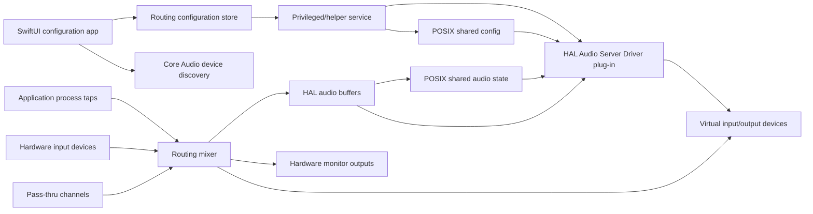

# Architecture

## Product Surface

The target feature set matches the major Loopback workflow:

- Create multiple virtual audio devices.
- Add application sources, hardware input sources, and pass-thru channels.
- Route sources into output channels with per-channel mappings.
- Monitor a virtual device through one or more hardware outputs.
- Rename devices and channels.
- Persist routing graphs.
- Keep devices available to other apps as normal macOS audio input devices.

## System Boundary

There are two distinct processes:

1. **Configuration app**
   - Built with SwiftUI and AppKit.
   - Lists physical audio devices.
   - Presents virtual devices and routing graphs.
   - Writes signed configuration data for the driver/helper.

2. **Core Audio HAL plug-in**
   - Loaded by Core Audio's audio server.
   - Publishes virtual devices.
   - Owns real-time audio IO.
   - Must avoid blocking work, UI APIs, allocation-heavy code, and direct SwiftUI dependencies.

## Suggested Runtime Flow

## Implementation Notes

- Use `AudioObject` APIs to enumerate hardware devices.
- Use process taps on supported macOS versions to capture application audio.
- Use an Audio Server Driver plug-in for virtual devices. AudioDriverKit is useful for DriverKit extensions, but HAL plug-ins remain the practical route for app-visible virtual audio devices.
- Keep the driver model small and serializable. The app owns rich editing; the driver receives a validated runtime graph.
- Use a ring buffer per source and per monitor path. Avoid locks in render callbacks.
- Keep route evaluation deterministic. `HeartechoAudio.RoutingMixer` is the current offline reference implementation for turning a validated routing graph plus source buffers into virtual device output channels.
- Use `AudioRingBuffer` as the current non-driver capture buffer for process taps and hardware inputs. It is intentionally simple for app/helper use; the HAL render path should move to a real-time safe variant.
- Use `LevelMeter` for UI metering calculations from source or mixed buffers.
- Keep capture sessions in the app-facing audio controller keyed by `AudioSource.id`. Application sources use `ProcessTapCaptureSession`; hardware input sources use `HardwareInputCaptureSession` with a Core Audio device IOProc. SwiftUI source cards only issue explicit commands; they do not own Core Audio objects.
- Use `RuntimeRoutingEngine` as the app/helper render coordinator. It pulls available source buffers from application and hardware capture sessions, resolves nested virtual-device sources recursively with cycle protection, merges injected/test buffers, calls `RoutingMixer`, and returns per-device render reports. The HAL render callback should mirror this boundary with real-time safe storage.
- Use `HALRenderPublisher` as the current diagnostic bridge from `RuntimeRenderReport` into `Sources/HALDriverC` audio buffers. It maps virtual-device IDs to the shared HAL object IDs generated by `HALDriverBridge`, opens the live POSIX shared-memory audio state, writes mixed frames, and returns a publication report for UI/diagnostics.
- Use `HeartechoHelperRuntime` and the `HeartechoHelper` executable as the current helper scaffold. It loads `RoutingGraph.json`, optionally creates a starter graph for development, publishes HAL config shared memory, can render/write live audio shared memory without installing a driver, and can run a finite or continuous publication loop.
- Use `MonitorOutputEngine` to consume runtime render reports and maintain per-monitor buffers/levels. It is the current app/helper monitor pipeline; the next layer should bind monitor sessions to actual hardware output devices.
- Use `HardwareMonitorPlaybackSession` for explicit app-side monitor playback. It uses AudioQueue when a monitor has a Core Audio output-device UID, because `kAudioQueueProperty_CurrentDevice` can bind the queue to that device. It falls back to AVAudioEngine/AVAudioSourceNode for default output.
- Use `Sources/HALDriverC` as the system-driver boundary. It is a C AudioServerPlugIn skeleton that compiles against the local SDK, answers dynamic device/stream properties from the shared config snapshot, and can read from the active live audio shared-memory state. Swift remains responsible for app UI, routing graph validation, and non-real-time runtime configuration.

The current HAL audio buffer is still intentionally compact for local verification, but it now has a live POSIX shared-memory mapping path instead of only a copied snapshot path. Each supported virtual device gets a fixed 64-channel slot, helper/app code writes frame counters and samples into the mapped state, and the HAL IO path reads from the active state without taking the previous prototype mutex. It is useful for proving ABI shape, multi-device render semantics, and cross-process persistence; installed-driver validation, signed helper ownership, and a deeper real-time audit are still required.
